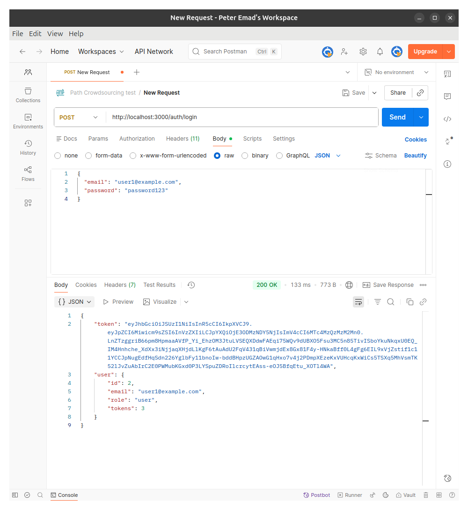
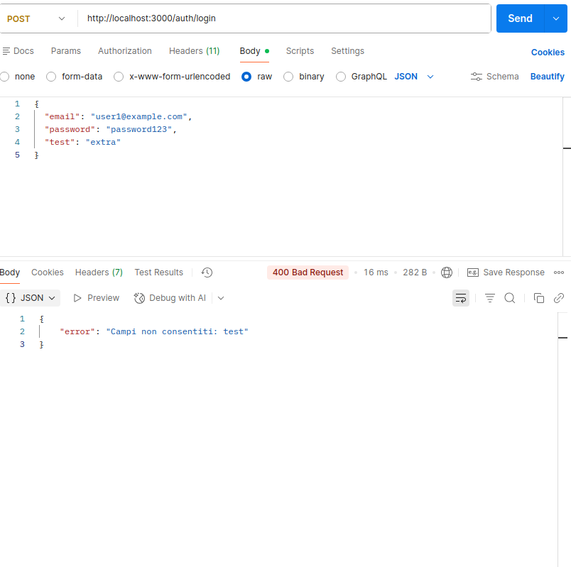
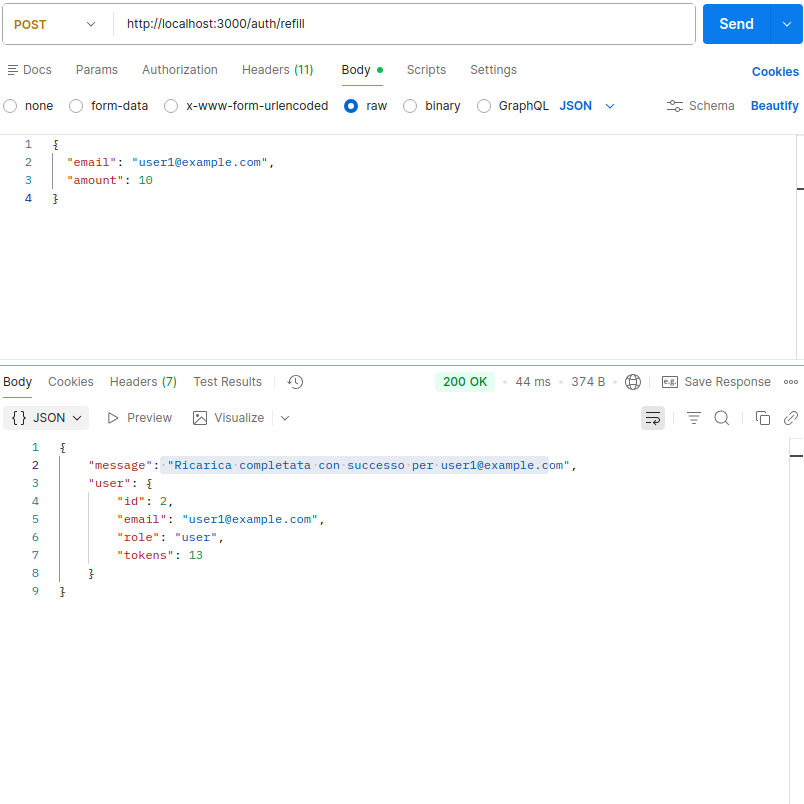

# Path Crowdsourcing

## Obiettivo del Progetto

**Path Crowdsourcing** è una piattaforma back-end che implementa un sistema collaborativo (crowdsourcing) per la gestione e l'evoluzione di modelli di griglia utilizzati per il calcolo di percorsi ottimali. Il sistema permette a utenti autenticati di:

- **Creare modelli** di griglia (matrici binarie 0/1) specificando dimensioni e valori iniziali. Ogni creazione ha un costo in token (0.025 per cella), addebitato all'utente.
- **Eseguire l'algoritmo A*** su un modello esistente fornendo punto di partenza e arrivo, ottenendo il percorso minimo, il costo in passi e il tempo di esecuzione. Anche l'esecuzione consuma token (stesso costo della creazione).
- **Proporre modifiche** a una o più celle di un modello di cui non si è proprietari. La richiesta, che costa 0.25 token per cella, viene posta in stato *pending* in attesa di approvazione o rifiuto da parte del proprietario del modello.
- **Gestire le richieste** in sospeso: il proprietario può approvare o rifiutare singolarmente o in modalità bulk; in caso di approvazione, la griglia viene aggiornata automaticamente.
- **Visualizzare lo storico** delle modifiche di un modello, con filtri per data e stato, e lo stato di pending di un modello.
- **Ricevere notifiche** delle richieste pendenti relative ai propri modelli tramite apposite rotte.

Il sistema adotta un meccanismo di **token** per regolare l'uso delle risorse: ogni utente dispone di un credito iniziale (impostato tramite seed) che viene decrementato a ogni operazione a pagamento. Gli amministratori possono ricaricare il credito di un utente tramite un'endpoint dedicata. L'autenticazione è basata su **JWT** con firma RS256 e le chiavi sono caricate da file `docker-compose.yml`.


## Progettazione

### Diagrammi UML

#### Diagramma dei Casi d'Uso

> *[Da inserire]*

#### Diagrammi delle Sequenze

> *[Da inserire]*

---

### Descrizione dei Pattern Utilizzati

Il progetto adotta tre pattern architetturali principali, scelti per garantire separazione delle responsabilità, manutenibilità e scalabilità del codice.

#### 1. Model-View-Controller (MVC)

**Descrizione**:  
Il pattern MVC è stato implementato per separare la logica di presentazione (routes/controllers) dalla logica di business (services) e dalla gestione dei dati (models).

- **Model** (`models/`): Definisce la struttura dei dati e le relazioni tramite Sequelize. Gestisce la persistenza e le operazioni di base sul database.
- **Controller** (`controllers/`): Riceve le richieste HTTP, estrae i dati, chiama i servizi appropriati e restituisce le risposte al client.
- **Service** (`services/`): Contiene la logica di business dell'applicazione, coordina le operazioni tra repository e modelli, e gestisce le regole di dominio (es. calcolo costi in token, validazioni).

**Motivazione**:  
MVC è stato scelto perché:
- **Separa chiaramente le responsabilità**: I controller gestiscono solo l'input/output HTTP, i service contengono la logica di business, i modelli gestiscono la persistenza.
- **Facilita il testing**: È possibile testare service e repository in isolamento senza dipendere dal livello HTTP.
- **Migliora la manutenibilità**: Modifiche alla logica di business o alla struttura dei dati non influenzano il livello di presentazione.

**Esempio nel progetto**:  
`ModelController` delega a `ModelService` la creazione di un modello; `ModelService` utilizza `GridModelRepository` per l'accesso al database e `UserRepository` per la gestione dei token.

---

#### 2. Repository Pattern

**Descrizione**:  
Il pattern Repository è stato implementato per fornire un'interfaccia di accesso ai dati che astrae i dettagli dell'ORM (Sequelize) e del database sottostante.

- `UserRepository`: Gestisce le operazioni CRUD sugli utenti, inclusa la gestione dei token.
- `GridModelRepository`: Gestisce le operazioni sui modelli di griglia.
- `UpdateRequestRepository`: Gestisce le operazioni sulle richieste di aggiornamento, con metodi specializzati per filtri e ricerche complesse.

**Motivazione**:  
Il Repository pattern è stato scelto perché:
- **Astrazione del livello dati**: I service interagiscono con i repository senza conoscere i dettagli implementativi di Sequelize o del database.
- **Centralizzazione delle query**: Le query complesse (es. filtri per data, stato) sono incapsulate nei repository, evitando duplicazione di codice.
- **Facilita il testing**: È possibile mockare i repository per testare i service in isolamento.
- **Manutenibilità**: Cambiamenti nello schema del database o nell'ORM richiedono modifiche solo nei repository, non nei service.

**Esempio nel progetto**:  
`UpdateRequestService` utilizza `UpdateRequestRepository.findHistory()` per ottenere lo storico delle modifiche con filtri, senza dover costruire manualmente le condizioni `WHERE` in ogni chiamata.

---

#### 3. Chain of Responsibility (Middleware)

**Descrizione**:  
Il pattern Chain of Responsibility è stato implementato attraverso il sistema di middleware di Express. Ogni richiesta attraversa una catena di middleware che gestiscono aspetti specifici in sequenza.

- `authMiddleware`: Verifica la presenza e la validità del token JWT.
- `roleMiddleware`: Controlla che l'utente abbia il ruolo richiesto (es. admin).
- `tokenCheckMiddleware`: Verifica che l'utente abbia credito sufficiente per eseguire l'operazione.
- Middleware di validazione (`express-validator` + `validate`): Validano i dati in input.
- `errorMiddleware`: Gestisce centralmente gli errori e restituisce risposte JSON formattate.

**Motivazione**:  
La Chain of Responsibility è stata scelta perché:
- **Separazione delle responsabilità**: Ogni middleware ha un compito specifico e ben definito (autenticazione, autorizzazione, validazione, gestione errori).
- **Componibilità**: I middleware possono essere combinati liberamente sulle rotte, consentendo di riutilizzare la stessa logica in contesti diversi.
- **Manutenibilità**: Aggiungere o modificare un comportamento (es. aggiungere un nuovo controllo) richiede solo di inserire un nuovo middleware nella catena, senza toccare il codice esistente.
- **Gestione centralizzata degli errori**: `errorMiddleware` cattura tutte le eccezioni e restituisce risposte uniformi, migliorando l'esperienza del client.

**Esempio nel progetto**:  
La rotta `POST /models/create` utilizza una catena di middleware:
1. `authMiddleware` → verifica autenticazione
2. `roleMiddleware("user")` → verifica ruolo
3. `tokenCheckMiddleware` → verifica credito
4. Middleware di validazione → validano `width`, `height`, `grid`
5. `validate` → trasforma errori di validazione in risposta 400
6. `modelController.createModel` → esegue la logica di business

In caso di errore in qualsiasi punto della catena, `errorMiddleware` gestisce l'eccezione e restituisce una risposta appropriata.

---

### Riassunto dei Pattern Utilizzati

| Pattern | Scopo | Beneficio principale |
|---------|-------|---------------------|
| **MVC** | Separazione presentazione, business e dati | Manutenibilità e testabilità |
| **Repository** | Astrazione del livello di accesso ai dati | Disaccoppiamento e centralizzazione delle query |
| **Chain of Responsibility** | Gestione delle richieste attraverso middleware componibili | Separazione delle responsabilità e riusabilità |

## Come avviare il progetto con Docker Compose

Il progetto è completamente containerizzato e può essere avviato con un unico comando. Tutti i servizi necessari (applicazione Node.js, database SQLite, generazione delle chiavi JWT e popolamento iniziale del database) vengono gestiti automaticamente tramite **Docker Compose**.


### Avvio del progetto

1. Clona il repository:

   ```bash
   git clone https://github.com/Petmadsh/path-crowdsourcing.git
   cd path-crowdsourcing
   ```

2. Avvia il progetto con Docker Compose:

   ```bash
   docker-compose up --build
   ```

### Operazioni eseguite automaticamente

Al primo avvio, il container esegue automaticamente le seguenti operazioni:

- Generazione delle chiavi RSA (`private.pem` e `public.pem`) nella cartella `keys/`;
- Creazione del database SQLite in `data/database.sqlite`;
- Popolamento del database con i dati iniziali (utenti, modelli e richieste di aggiornamento);
- Avvio del server Express sulla porta **3000**.

### Accesso all'applicazione

Una volta completato l'avvio, l'applicazione sarà disponibile all'indirizzo:

```text
http://localhost:3000
```
---

## Test dei Middleware con Jest

Per garantire l'affidabilità e la correttezza dei componenti critici, il progetto include test unitari dei middleware utilizzando **Jest** come framework di testing. I test verificano il comportamento dei principali middleware dell'applicazione, assicurando che gestiscano correttamente sia i casi di successo sia quelli di errore.

### Middleware testati

#### 1. `authMiddleware`

Questo middleware è responsabile dell'autenticazione tramite **JSON Web Token (JWT)**.

I test verificano i seguenti scenari:

- **Token mancante**: una richiesta priva dell'header `Authorization` deve restituire `401 Unauthorized`.
- **Token non valido**: un token malformato o con firma non valida deve essere rifiutato con `401 Unauthorized`.
- **Token valido**: il middleware deve decodificare il token, estrarre `id` e `role` dell'utente, salvarli in `req.user` e chiamare il middleware successivo.

**Esempio di test** (`authMiddleware.test.ts`):

```typescript
test('dovrebbe impostare req.user e chiamare next se il token è valido', () => {
  req.headers = { authorization: 'Bearer valid-token' };
  const decoded = { id: 1, role: 'user' };

  const jwt = require('jsonwebtoken');
  jwt.verify.mockReturnValue(decoded);

  authMiddleware(req as Request, res as Response, next);

  expect(req.user).toEqual(decoded);
  expect(next).toHaveBeenCalledWith();
});
```

---

#### 2. `errorMiddleware`

Questo middleware gestisce centralmente gli errori generati durante l'elaborazione delle richieste.

I test verificano:

- **Errore generico**: un errore non appartenente alla classe `HttpError` deve produrre una risposta con status `500 Internal Server Error` e il relativo messaggio.
- **Errore HTTP personalizzato**: un errore creato tramite `createError()` deve mantenere il codice di stato e il messaggio specificato.

**Esempio di test** (`errorMiddleware.test.ts`):

```typescript
test('dovrebbe restituire status e messaggio corretti per HttpError', () => {
  const err = createError(400, 'Bad request');

  errorMiddleware(err, req as Request, res as Response, next);

  expect(res.status).toHaveBeenCalledWith(400);
  expect(res.json).toHaveBeenCalledWith({
    error: 'Bad request',
  });
});
```

## Esecuzione dei test

I test possono essere eseguiti in due modalità.

### Localmente

Dopo aver installato le dipendenze del progetto:

```bash
npm test
```

### All'interno del container Docker

Se l'applicazione è in esecuzione tramite Docker Compose:

```bash
docker exec -it path-crowdsourcing-app npm test
```

## Configurazione di Jest

Il file `jest.config.js` utilizza **ts-jest** per l'esecuzione dei test TypeScript e ricerca automaticamente i file presenti nella cartella `src/**/__tests__/`.

```javascript
module.exports = {
  preset: 'ts-jest',
  testEnvironment: 'node',
  roots: ['<rootDir>/src'],
  testMatch: ['**/__tests__/**/*.test.ts'],
  transform: {
    '^.+\\.tsx?$': ['ts-jest', { tsconfig: 'tsconfig.json' }],
  },
};
```

## Test del progetto mediante chiamate con Postman

Questa sezione sarà completata con una raccolta di esempi di chiamate effettuate con **Postman** per verificare il corretto funzionamento di tutti gli endpoint dell'applicazione.

### Endpoint da testare

Di seguito l'elenco delle principali rotte da validare, con relative richieste e risposte attese.

#### 1. Autenticazione

- **POST /auth/login** – Login utente e ottenimento token JWT.
#### ✅ CASO 1: Successo – Credenziali valide



#### ❌ CASO 2: Errore – Email non valida (formato errato)

.png)

#### ❌ CASO 3: Errore – Campo Password mancante


#### ❌ CASO 4: Errore – Credenziali errate (utente non trovato o password sbagliata)

.png)

#### ❌ CASO 5: Errore – Campi extra non consentiti nel body



- **POST /auth/refill** – Ricarica token (solo admin).
#### ✅ CASO 6: Successo – Ricarica valida



#### ❌ CASO 7: Errore – Token mancante o non valido

.png)

.png)

#### ❌ CASO 8: Errore – Utente non autorizzato (ruolo diverso da admin)

.png)

.png)


#### 2. Modelli (Grid Models)

- **GET /models** – Elenco modelli dell'utente.
- **GET /models/:id** – Dettaglio di un modello.
- **POST /models/create** – Creazione nuovo modello con griglia.
- **POST /models/:id/execute** – Esecuzione dell'algoritmo A* su un modello.

#### 3. Richieste di aggiornamento

- **POST /updates/create** – Proposta di modifica di una o più celle.
- **POST /updates/:id/approve** – Approvazione di una richiesta pending.
- **POST /updates/:id/reject** – Rifiuto di una richiesta pending.
- **POST /updates/bulk** – Approvazione/rifiuto in blocco di più richieste.
- **GET /updates/sent** – Richieste inviate dall'utente.
- **GET /updates/received** – Richieste ricevute (per modelli di proprietà).
- **GET /updates/history/:modelId** – Storico modifiche con filtri.
- **GET /updates/status/:modelId** – Verifica presenza di richieste pending.
